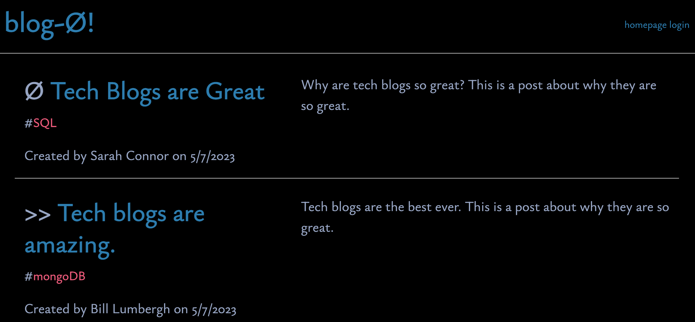
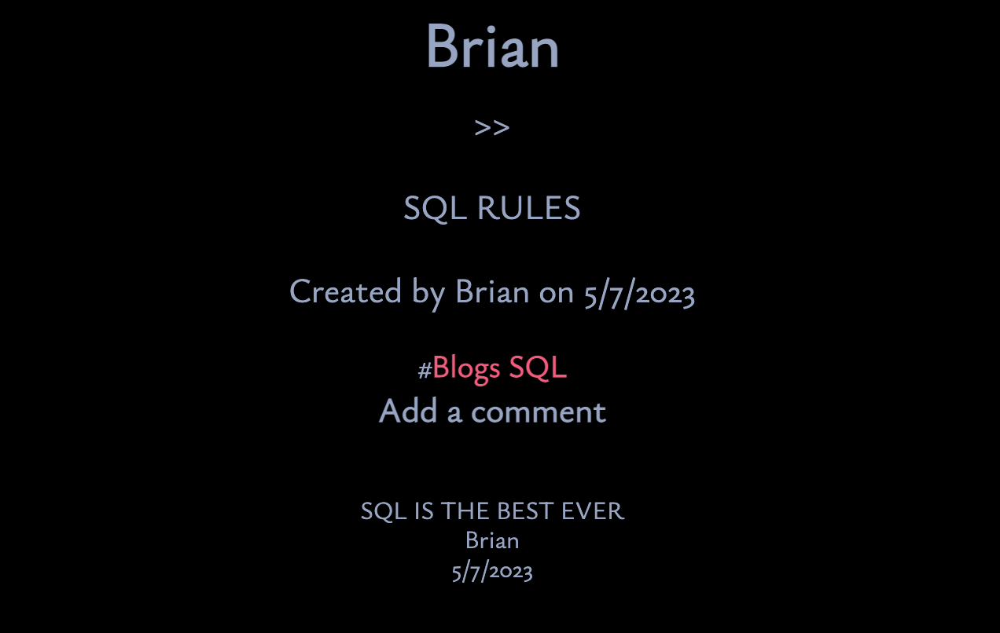

# techblog

## Description

This program is a tech blog that allows for user comments.

## Table of Contents

- [Description](#description)

- [Installation](#installation)

- [Usage](#usage)

- [License](#license)

- [Credits](#credits)

- [Questions](#questions)

## Installation

The project is deployed on heroku here https://sleepy-caverns-33323.herokuapp.com/ You have to be logged in to see the comments. Once you are logged in you can create a new post or add a comment to a different post.

## Usage

## License

MIT

## Credits

Thanks to eveyone at edX coding bootcamps! Getting SQL to talk to itself with new data was a huge challenge, plus using Models, Views and Controllers and getting them to play nicely.

## Questions

Email me at bcebel@gmail.com or visit my github page https://github.com/bcebel if you have any questions.
